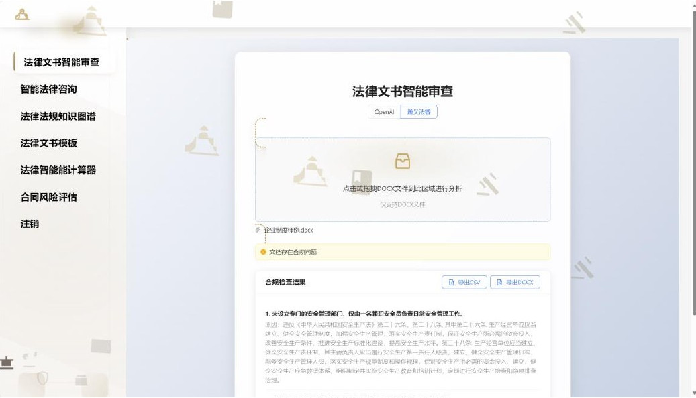
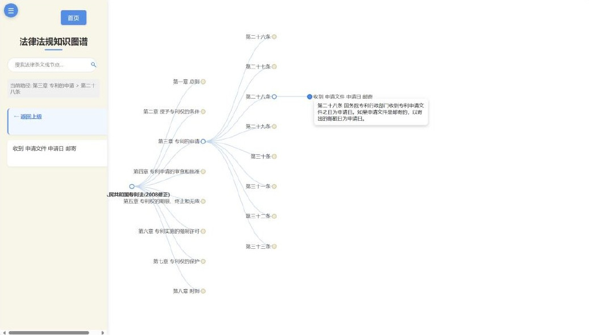
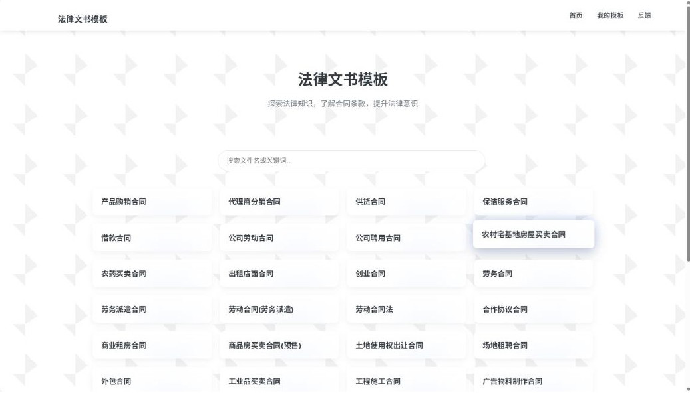
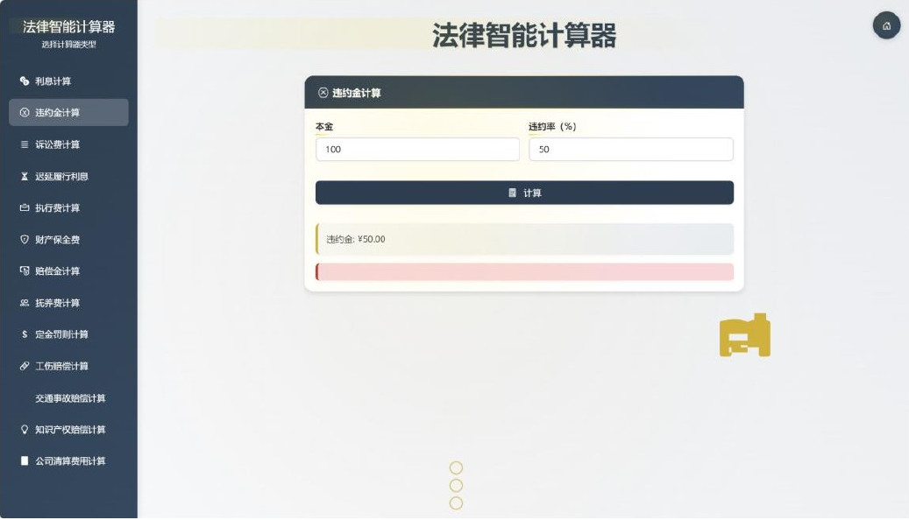
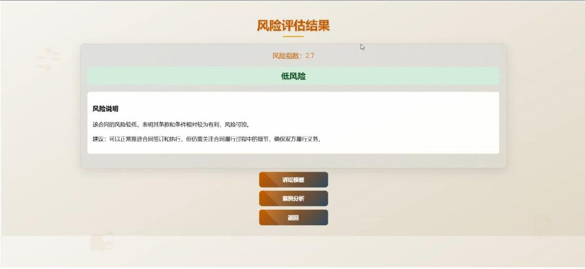
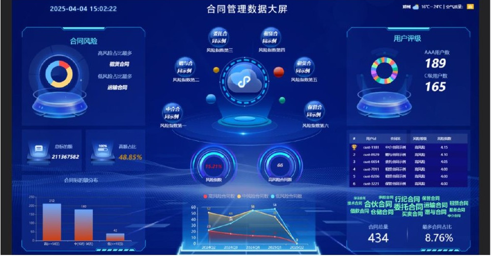
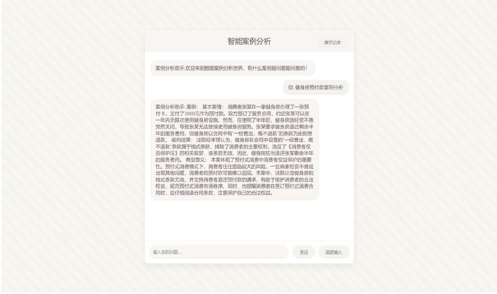

# LawDesign · 法律智能体平台

> **公开快照说明**：这是学习项目当前源码的整理版本，不包含原私有仓库的旧历史。部分模块依赖数据库、Kafka、API Key 等外部配置，截图是演示界面，不代表在线服务或全部链路已验证。请先看 [PUBLIC_SNAPSHOT.md](PUBLIC_SNAPSHOT.md)，按实际代码和配置自行验证。

围绕法律咨询、合同审查和诉讼文书生成做的多模块练习项目，不提供线上法律建议。
采用 **monorepo** 结构：`services/` 下每个子目录是一个可独立启动的服务，`shared/` 存放公共代码，`frontend/` 是 React 前端，`spark/` 是 Scala 实时流处理模块。

## 目录结构

```
.
├── frontend/                 # React + TypeScript + antd 前端（Vite）
├── services/                 # 后端服务（每个子目录可独立运行）
│   ├── auth/                 # 登录 / 注册 / 鉴权            :5000
│   ├── compliance/           # 合同合规审查 API（FastAPI）     :8000
│   ├── admin/                # 用户管理 / 管理员端            :5009 :5011
│   ├── contract_data/        # 合同数据查询                   :5010
│   ├── manager/              # 管理端门户 + 反馈收集          :8003 :5032 :5033
│   ├── lawshow/              # 法律数据可视化                 :5003
│   ├── analysis_case/        # 案例分析（Moonshot）           :5006
│   ├── calculate/            # 利息 / 违约金计算              :5007
│   ├── spark_dashboard/      # Spark 风控看板 + Kafka 生产者   :5008
│   ├── risk_analysis/        # 合同风险分析                   :5020
│   ├── litigation/           # 诉讼文书（模型/管理/编辑/反馈） :5025-5031
│   ├── agreement/            # 合同模板（管理/生成/编辑/反馈） :5027-5034
│   └── qa/                   # 法律问答（GraphRAG）           :5002 :5005 :8012
├── shared/                   # 公共 Python 包 lawdesign-shared
│   ├── config.py             #   环境变量 / 数据库 / 路径 / 路径穿越防护
│   ├── db.py                 #   数据库连接 + 游标上下文（自动关闭 / 提交）
│   ├── feedback.py           #   通用反馈表单 App 工厂（agreement / litigation 共用）
│   └── web.py                #   Flask / FastAPI 脚手架（secret_key、CORS、启动参数）
├── spark/                    # Scala + Spark Streaming
└── scripts/                  # start_all.sh / stop_all.sh / build_frontend.sh
```

## 架构总览

```
                      ┌─────────────────────────────┐
                      │   frontend (Vite dev :5173) │
                      └──────────────┬──────────────┘
                                     │ HTTP
   ┌───────────────┬─────────────────┼──────────────────┬──────────────────┐
   ▼               ▼                 ▼                  ▼                  ▼
┌────────┐  ┌─────────────┐  ┌──────────────┐  ┌───────────────┐  ┌──────────────┐
│ 登录    │  │ 合同合规审查 │  │ GraphRAG API │  │ 管理端门户     │  │ 各业务服务   │
│ :5000  │  │  :8000      │  │  :8012       │  │  :8003        │  │  :5003-5034  │
└───┬────┘  └─────────────┘  └──────────────┘  └───────────────┘  └──────────────┘
    │
    ▼
┌──────────────────────────────────────────────┐
│            MySQL  (DB_HOST)                  │
│  users / administrator / contract_db / feedback│
└──────────────────────────────────────────────┘

spark/ (Scala) ──Kafka (KAFKA_BOOTSTRAP_SERVERS)──► SparkShow :5008
```

## 功能展示

以下界面截图精选自 **2025 年《LegalMind 法律文书智能检测系统》项目报告**，展示当时的产品原型与功能流程；页面样式、示例数据不代表当前部署状态。这里只收录功能画面，未上传完整报告或登录账号截图。

| 平台首页：各功能入口 | 法律文书审查：上传文档并查看检测结果 |
|---|---|
|  |  |
| 法规知识图谱：法条关系与检索 | 合同模板：分类浏览与选择 |
|  |  |
| 法律计算器：计算项目与结果 | 合同风险评估：风险等级与说明 |
|  |  |
| 合同数据看板：风险与趋势可视化 | 案例分析：对话式问答示例 |
|  |  |

> 截图用于展示历史项目界面，不构成法律建议；具体功能是否可运行，请按下方「快速开始」配置相关服务与依赖后验证。

## 服务清单

| 服务 | 目录 | 入口 | 端口 | 技术栈 |
|---|---|---|---|---|
| 登录 / 注册 / 鉴权 | `services/auth` | `login.py` | 5000 | Flask + MySQL |
| 合同合规审查 API | `services/compliance` | `main.py` | 8000 | FastAPI + OpenAI / 通义 |
| 用户管理 | `services/admin` | `userDate.py` | 5009 | Flask + MySQL |
| 管理员端 | `services/admin` | `administrator.py` | 5011 | Flask + MySQL |
| 合同数据 | `services/contract_data` | `contractData.py` | 5010 | Flask + MySQL |
| 管理端门户 | `services/manager` | `manager.py` | 8003 | Flask |
| 反馈收集 | `services/manager` | `feedback.py` / `feedback_b.py` | 5032 / 5033 | Flask + MySQL |
| 法律问答 | `services/qa/ragtest/utils` | `QA.py` | 5002 | Flask → 8012 |
| GraphRAG 问答页 | `services/qa/ragtest/utils` | `app.py` | 5005 | FastAPI |
| GraphRAG 检索 API | `services/qa/ragtest/utils` | `main.py` | 8012 | FastAPI + graphrag |
| LawShow 数据展示 | `services/lawshow` | `lawshow.py` | 5003 | Flask |
| 案例分析 | `services/analysis_case` | `kimiapi.py` | 5006 | Flask + Moonshot |
| 利息 / 违约金计算 | `services/calculate` | `caculate.py` | 5007 | Flask |
| Spark 风控看板 | `services/spark_dashboard` | `show.py` | 5008 | Flask + MySQL |
| 风险分析 | `services/risk_analysis` | `riskanalysis.py` | 5020 | Flask + MySQL |
| 诉讼文书模型 | `services/litigation` | `modellitigation.py` | 5025 | Flask |
| 诉讼文书管理 | `services/litigation` | `managelitigation.py` | 5026 | Flask |
| 诉讼模板编辑 | `services/litigation` | `mymodel.py` | 5030 | Flask |
| 诉讼反馈 | `services/litigation` | `feedback.py` | 5031 | Flask + MySQL |
| 合同模板管理 | `services/agreement` | `managelagreement.py` | 5027 | Flask |
| 合同模板生成 | `services/agreement` | `modelagreement.py` | 5028 | Flask |
| 合同模板编辑 | `services/agreement` | `mymodel.py` | 5029 | Flask |
| 合同反馈 | `services/agreement` | `feedback.py` | 5034 | Flask + MySQL |
| 前端 | `frontend` | `vite dev` | 5173 | React + TS + antd |
| Kafka 生产者 | `services/spark_dashboard` | `producer.py` | — | kafka-python |
| Spark 流处理 | `spark` | `sparkStream.scala` | — | Scala + Spark Streaming |

## 快速开始

### 1. 环境要求
- Python 3.10+（graphrag 需要 3.10+）
- Node.js 18+ / pnpm（前端构建）
- MySQL 5.7+；Kafka、Spark（按需）

### 2. 安装依赖
```bash
python3 -m venv .venv && source .venv/bin/activate
pip install -r requirements.txt
pip install -e .            # 安装 lawdesign-shared 公共包（必须）
# GraphRAG 模块（可选）
pip install -e ".[qa]"
```

### 3. 配置环境变量
```bash
cp .env.example .env          # 根目录：数据库 / 密钥 / CORS
cp services/qa/ragtest/.env.example services/qa/ragtest/.env   # GraphRAG
# 编辑这两个文件，填入数据库密码与各 API Key
```

### 4. 启动 / 停止
```bash
./scripts/start_all.sh            # 一键启动全部后端服务（日志 logs/，PID logs/*.pid）
./scripts/start_all.sh login qa   # 只启动指定服务
./scripts/stop_all.sh             # 全部停止

# 也可以单独启动（自动import shared，无需先 pip install -e .）
python3 services/auth/login.py
```

### 5. 前端
```bash
cd frontend && pnpm install
pnpm dev                                   # 开发模式 http://localhost:5173
./scripts/build_frontend.sh                # 构建并同步到 services/{auth,compliance}/static/dist
```

## 环境变量

密钥与基础设施配置一律通过环境变量注入，**不要提交真实值**：

| 变量 | 说明 |
|---|---|
| `DB_HOST` / `DB_USER` / `DB_PASSWORD` / `DB_NAME` | MySQL 连接 |
| `SECRET_KEY` | Flask session 密钥（生产必须固定） |
| `FLASK_DEBUG` | `true` 时开启调试模式（仅限本地） |
| `OPENAI_API_KEY` / `DASHSCOPE_API_KEY` / `MOONSHOT_API_KEY` | 各模型服务密钥 |
| `GRAPHRAG_CHAT_API_KEY` / `GRAPHRAG_EMBEDDING_API_KEY` | GraphRAG 密钥 |
| `KAFKA_BOOTSTRAP_SERVERS` | Kafka 地址 |
| `CORS_ORIGINS` | 允许的跨域来源（逗号分隔） |
| `SERVICE_HOST` / `SERVICE_PORT` | 覆盖单个服务的监听地址 / 端口 |
| `LOGIN_PORT` | 登录服务端口（默认 5000） |
| `GRAPH_API_BASE` | GraphRAG 问答后端地址（默认 `http://127.0.0.1:8012`） |
| `ADMIN_DEFAULT_USERNAME` / `ADMIN_DEFAULT_PASSWORD` | 首次初始化时创建的管理员账号口令 |
| `MANAGER_URL` | 管理端门户地址（默认 `http://127.0.0.1:8003`） |

## 设计约定

* **所有路径基于 `__file__`**：服务内数据目录一律用 `config.path_from(__file__, "xxx")` 解析，
  从任何工作目录启动都不会错；不再使用 `../XXX` 这类相对路径。
* **配置单一来源**：数据库、密钥、CORS 只在 `shared/config.py` 中实现一份，
  各服务通过 `from shared import config, web` 使用。
* **数据库访问一律走 `shared.db`**：用 `with db.db_cursor(driver, commit=True) as cursor:`
  管理连接与游标生命周期，不要自己写 `connect / cursor / commit / close` 四步样板。
  驱动差异（mysql-connector 的 `dictionary=True` 与 PyMySQL 的 `DictCursor`）已在 `db.py` 内消化。
* **同构服务用工厂函数复用**：`agreement` 与 `litigation` 两套反馈表单完全一致，
  由 `shared.feedback.create_feedback_app()` 生成，只追加表名，不复制代码。
* **异常不回流前端**：面向用户的错误只返回固定文案，细节进 `app.logger.exception()`。
* **文件操作必须过 `config.safe_path()`**：拒绝 `..` / 绝对路径，防目录穿越。
* **零密钥入库**：只提交 `.env.example` 模板；`.env`、`one-api.exe`、GraphRAG 产物全部 gitignore。

## 已知问题与技术债务

1. **前端 / 模板里的端口硬编码**（最突出）：`frontend/src/App.tsx`、`services/qaService.ts`、
   `services/complianceService.ts` 以及 `services/*/templates/*.html` 中仍写死
   `127.0.0.1:5000/5002/5003/5007/5020/8000/8012` 等地址，导致服务只能跑在本机固定端口。
   应前端抽 `VITE_API_BASE`、后端补一层网关或反向代理。
2. **仍有 30 余处把内部异常文案回显给前端**（`str(e)`），本轮已修
   `login.py` / `administrator.py` / `userDate.py` / `contractData.py` / `riskanalysis.py` /
   `show.py` / `feedback*.py` / `manage*.py`，其余服务待同样处理。
3. **前端构建产物入库**：`services/{auth,compliance}/static/dist/` 下约 1.2MB 的
   `index-*.js` 重复提交了两份，另有 `services/lawshow/data.json` 等数据文件在公开快照中已替换为空结构；
   前端构建产物后续应改 CI 构建。
4. **`services/qa/law/` 与 `services/qa/ragtest/input/` 内容完全相同**（约 378KB 重复，
   无代码引用前者），属历史遗留，可去重。
5. **默认管理员口令**：`administrator.py` 首次初始化不再使用固定默认口令，
   必须设置 `ADMIN_DEFAULT_PASSWORD` 后才能创建管理员。
6. **LPR 硬编码**：`services/calculate/caculate.py` 的 `get_latest_lpr()` 返回固定值 3.7，
   `services/spark_dashboard/show.py` 中同样硬编码，未接真实数据源。
7. **多个 MySQL 库名**：`flask_login_system`（用户/反馈）与 `contract_db`（合同/风控）混用，
   建议统一或加 Schema 说明。
8. **缺少自动化测试**：目前只有 `py_compile` + `pyflakes` 级保障，
   建议补 pytest + 健康检查端点。
9. **Kafka / Spark 未纳入一键启动**：需单独部署。
10. **GraphRAG 配置未并入 shared**：`services/qa/ragtest/settings.yaml` 与 `db_config()`
    仍使用 `${VAR}` 占位符自行解析，未走 `shared.config`。

## 开发自检

```bash
python3 -m compileall -q services shared     # 语法检查
python3 -m pyflakes services shared scripts  # 未定义名称 / 未使用导入
bash -n scripts/*.sh                         # 启动脚本语法检查
curl -fsS localhost:8003/health              # 管理端门户健康检查
```
